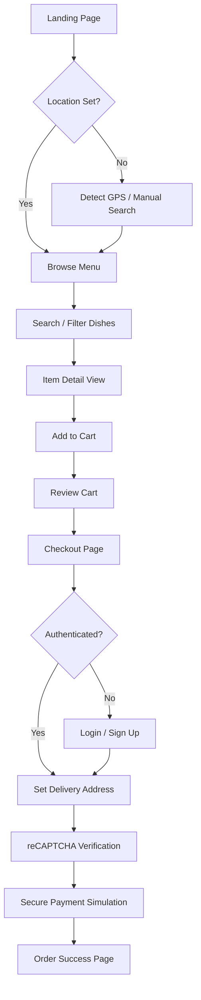
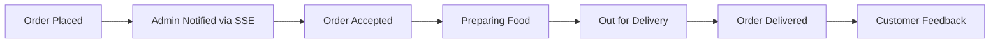
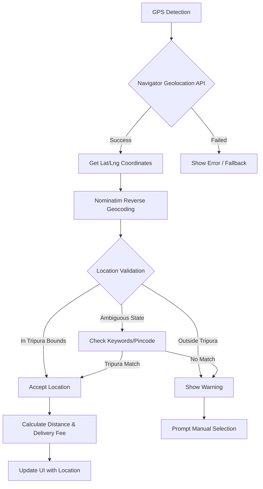
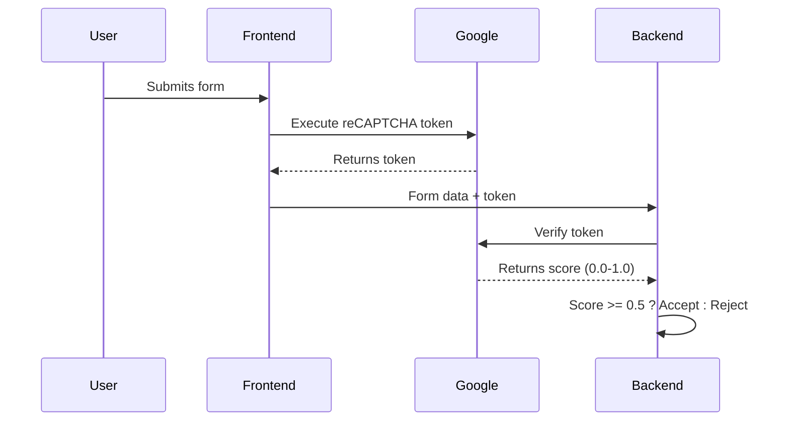

# 🍴 Lazeez - Premium Restaurant Management System

    

**Lazeez** is a full-stack, enterprise-grade restaurant management ecosystem. It bridges the gap between a high-converting, aesthetic customer storefront and a high-efficiency real-time admin operations hub. Designed for extreme performance and scalability, it leverages a serverless-first architecture to ensure zero downtime and instantaneous response times.

---

## 🚀 Key Features

### 🛍️ Customer Storefront
- **Dynamic Menu Discovery**: Fast, category-based browsing with real-time search powered by a Trie data structure.
- **Intelligent Location Service**: Automatic GPS detection and reverse geocoding via Nominatim (OpenStreetMap), with intelligent Tripura region detection. Calculates precise delivery fees based on distance using the Haversine formula.
- **Seamless Ordering Flow**: A frictionless path from dish selection to checkout with a persistent, session-based cart.
- **Premium UX**: Modern, responsive UI built with Tailwind CSS and Alpine.js, featuring skeleton loaders and slide-up mobile modals.
- **Order Tracking**: Real-time visibility into order status for the customer.

### 🛠️ Admin Operations Dashboard
- **Real-time Order Hub**: Instant notifications of new orders using Server-Sent Events (SSE), eliminating the need for page refreshes.
- **Dynamic Menu Management**: Full CRUD capabilities for categories and dishes, with immediate reflection on the storefront.
- **Order Lifecycle Control**: Manage order states from `Pending` $\rightarrow$ `Accepted` $\rightarrow$ `Preparing` $\rightarrow$ `Out for Delivery` $\rightarrow$ `Delivered`.
- **Analytics & Insights**: High-level overview of store performance and customer feedback.

### ⚙️ Core System Capabilities
- **Serverless Session Management**: Distributed session handling via Vercel KV (Upstash) for infinite scalability.
- **Automated Image Pipeline**: High-performance image processing converting all uploads to `AVIF` for maximum compression.
- **Strict Security**: RBAC (Role-Based Access Control), rate limiting, reCAPTCHA protection, and AES-256 encryption for sensitive customer data.
- **SEO Optimized**: Server-Side Rendering (SSR) with EJS for lightning-fast First Contentful Paint (FCP).

---

## 🏗️ Architecture & Project Flow

### 1. System Architecture
The project follows a **Layered Architecture** to ensure a strict separation of concerns:

`Request` $\rightarrow$ `Middleware (Auth/RateLimit/reCAPTCHA)` $\rightarrow$ `Router` $\rightarrow$ `Controller` $\rightarrow$ `Service/DB (Prisma)` $\rightarrow$ `Response`

### 2. Customer Journey Flow
This flowchart describes the path a customer takes from landing on the site to completing an order.



### 3. Order Lifecycle Flow
The lifecycle of an order from the moment it is placed until it reaches the customer.



### 4. Location Detection Flow
How the system detects and validates user location for Tripura delivery.



---

## 🛠️ Technology Stack

| Category | Technology | Purpose |
| --- | --- | --- |
| **Backend Framework** | Express.js 5.2 | High-performance routing and API design. |
| **Database & ORM** | Supabase (PostgreSQL) + Prisma | Scalable relational storage with strongly typed schema. |
| **Session Store** | Vercel KV (Upstash) | Serverless, HTTP-based distributed session management. |
| **View Engine** | EJS + Express Layouts | SSR for instantaneous load times and SEO. |
| **Styling** | Tailwind CSS + Alpine.js | Modern, responsive, and interactive premium UI. |
| **Authentication** | Firebase Admin SDK | Secure identity management and JWT validation. |
| **Bot Protection** | Google reCAPTCHA v3 | Invisible spam/bot protection on forms and checkout. |
| **Search Console** | Google Search Console | SEO monitoring and sitemap integration. |
| **Image Pipeline** | Sharp + Multer | Automated conversion of images to `AVIF` format. |
| **Real-time Comm** | Server-Sent Events (SSE) | Real-time server $\rightarrow$ admin push notifications. |
| **Email Service** | Resend API | Transactional emails for orders and notifications. |
| **Maps & Geocoding** | OpenStreetMap (Nominatim) + Leaflet.js | Free, open-source map tiles and geocoding. |

---

## 🌐 External Integrations

### Google reCAPTCHA v3
The project implements **invisible reCAPTCHA v3** for bot protection without disrupting user experience.

**Implementation Details:**
- **Site Key**: Frontend integration in `header.ejs`
- **Secret Key**: Backend verification in authentication routes
- **Score Threshold**: 0.5 (configurable based on sensitivity)
- **Protected Endpoints**: Login, Register, Checkout, Profile updates

**How it works:**


**Environment Variables Required:**
```env
RECAPTCHA_SITE_KEY="your-recaptcha-site-key"
RECAPTCHA_SECRET_KEY="your-recaptcha-secret-key"
```

> ⚠️ **Important**: Add your domain(s) to the [Google reCAPTCHA Admin Console](https://www.google.com/recaptcha/admin) to avoid 401 Unauthorized errors.

---

### Google Search Console Integration
The project is optimized for Google Search Console (GSC) indexing and monitoring.

**SEO Features:**
- **Server-Side Rendering (SSR)**: All pages are rendered on the server for proper crawling.
- **Meta Tags**: Comprehensive Open Graph, Twitter Card, and semantic HTML tags.
- **Structured Data**: JSON-LD schema markup for Restaurant/Food establishment.
- **Sitemap**: Dynamic XML sitemap generation at `/sitemap.xml`.
- **Robots.txt**: Configured for proper crawling directives.

**Required Setup:**
1. Add your domain to [Google Search Console](https://search.google.com/search-console)
2. Verify ownership via DNS TXT record or HTML file upload
3. Submit sitemap URL: `https://yourdomain.com/sitemap.xml`
4. Monitor Core Web Vitals and indexing status

**Meta Tags Implemented:**
```html
<!-- Primary Meta -->
<meta name="description" content="Order delicious food online...">
<meta name="robots" content="index, follow">

<!-- Open Graph (Social Sharing) -->
<meta property="og:type" content="website">
<meta property="og:title" content="Lazeez | Order Food Online">
<meta property="og:description" content="...">
<meta property="og:image" content="...">

<!-- Twitter Card -->
<meta name="twitter:card" content="summary_large_image">

<!-- Technical SEO -->
<link rel="canonical" href="https://yourdomain.com/page">
```

---

## 🧠 DSA & Core Concepts

### 1. Fast Search with Trie (Prefix Tree)
Instead of slow SQL `LIKE` queries, menu items are indexed in a **Trie**.
- **Complexity**: $O(L)$ search time (where $L$ is query length).
- **Benefit**: Instantaneous search results even with thousands of menu items.

### 2. AES-256-CBC Encryption
Customer PII (Personally Identifiable Information) is encrypted before storage.
- **Method**: Symmetric encryption with a secure 32-byte key and unique IV per operation.
- **Benefit**: Ensures data privacy and compliance with security standards.

### 3. Tiered Delivery Pricing
Delivery fees are calculated using the **Haversine Formula** to determine the great-circle distance between two points on a sphere.
- **Logic**: $\text{Fee} = \text{Base Rate} \times \lceil \text{Distance} / 5\text{km} \rceil$.
- **Tripura Focus**: GPS coordinates are validated against Tripura's bounding box (Lat: 22.9°-24.6°, Lng: 91.1°-92.3°) for delivery eligibility.

### 4. Geolocation with Nominatim
Uses OpenStreetMap's Nominatim API for free, privacy-respecting geocoding.
- **Reverse Geocoding**: GPS coordinates $\rightarrow$ Human-readable address
- **Forward Geocoding**: Search query $\rightarrow$ Lat/Lng coordinates
- **Tripura Filtering**: Results are filtered to prioritize Tripura locations using bounding boxes and keyword matching.

---

## 📁 Directory Structure

```text
lazeez/
├── prisma/                # Database schema and migrations
├── public/                # Static assets (CSS, JS, Images)
│   ├── css/               # Premium custom styles
│   ├── js/                # Client-side logic (Location, Realtime)
│   └── img/               # Brand assets and logos (SVG favicon)
├── src/
│   ├── config/            # Database and system configurations
│   ├── controllers/       # Business logic for each route
│   ├── middleware/        # Auth, Rate limiting, Validation, reCAPTCHA
│   ├── routes/            # API and Page endpoint definitions
│   │   ├── admin/         # Admin-specific operations
│   │   └── storefront/    # Customer-facing endpoints
│   ├── services/          # Independent logic (Realtime, Location)
│   ├── utils/             # Helper functions (Encryption, Trie)
│   └── views/             # EJS Templates
│       ├── admin/         # Admin dashboard views
│       ├── partials/      # Reusable UI components (Navbar, Footer)
│       └── storefront/    # Customer-facing page views
├── .env                   # Environment variables (Secrets)
├── app.js                 # Main application entry point
└── package.json           # Dependencies and scripts
```

---

## ⚙️ Setup & Installation

### 1. Prerequisites
- Node.js (v18.0.0+)
- PostgreSQL database (Supabase recommended)
- Vercel KV (Upstash) account
- Google reCAPTCHA keys (v3)
- Google Search Console access

### 2. Installation
```bash
npm install
```

### 3. Configuration
Create a `.env` file in the root directory:
```env
# Database
DATABASE_URL="postgresql://..."
DIRECT_URL="postgresql://..."

# Session & Security
SESSION_SECRET="your-long-random-secret"
ENCRYPTION_KEY="32-character-secure-key"

# Vercel KV (Upstash)
KV_REST_API_URL="https://..."
KV_REST_API_TOKEN="..."

# Firebase
FIREBASE_API_KEY="..."
FIREBASE_AUTH_DOMAIN="..."
FIREBASE_PROJECT_ID="..."

# Google reCAPTCHA v3
RECAPTCHA_SITE_KEY="6Lxxxxx"
RECAPTCHA_SECRET_KEY="6Lxxxxx"

# Email
RESEND_API_KEY="re_xxxxx"
```

### 4. Database Initialization
```bash
npx prisma migrate dev
node prisma/seed.js
node scripts/create-admin.js
```

### 5. Execution
```bash
npm run dev # Development mode with nodemon
npm start   # Production mode
```

---

## 💻 Operational Commands

| Command | Action |
| --- | --- |
| `npm run dev` | Starts server with hot-reload |
| `npx prisma generate` | Regenerates Prisma client after schema changes |
| `npx prisma studio` | Opens a GUI to browse and edit database data |
| `node scripts/update-menu.js` | Syncs menu items from external sources |

---

## 🔒 Security Implementation

| Security Feature | Implementation | Protection Against |
| --- | --- | --- |
| **reCAPTCHA v3** | Invisible bot scoring on forms | Bots, spam submissions |
| **Rate Limiting** | `express-rate-limit` on auth routes | Brute force, DoS attacks |
| **RBAC** | Admin middleware checks `role === 'admin'` | Unauthorized access |
| **AES-256-CBC** | Phone number encryption in database | Data breach exposure |
| **XSS Prevention** | EJS auto-escapes all output | Cross-site scripting |
| **Zod Validation** | Strict schema validation on inputs | SQL/NoSQL injection |
| **Secure Sessions** | HTTP-only, SameSite cookies | Session hijacking |
| **CSP Headers** | Content Security Policy | Malicious script injection |

---

## 🌟 Deployment Checklist

Before deploying to production, ensure:

- [ ] All environment variables are set in Vercel dashboard
- [ ] Domain added to Google reCAPTCHA Admin Console
- [ ] Domain verified in Google Search Console
- [ ] Sitemap submitted to Google Search Console
- [ ] `robots.txt` configured for production
- [ ] HTTPS enforced (automatic on Vercel)
- [ ] Database connection pooling enabled (Supabase PgBouncer)
- [ ] Session store (Upstash KV) provisioned

---

> _Designed for architectural elegance, extreme performance, and effortless scalability._
