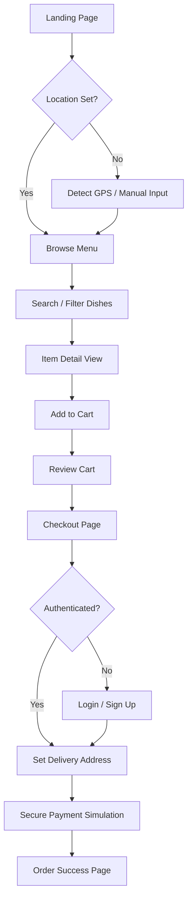
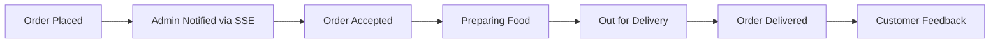

# 🍴 Lazeez - Premium Restaurant Management System

    

**Lazeez** is a full-stack, enterprise-grade restaurant management ecosystem. It bridges the gap between a high-converting, aesthetic customer storefront and a high-efficiency real-time admin operations hub. Designed for extreme performance and scalability, it leverages a serverless-first architecture to ensure zero downtime and instantaneous response times.

---

## 🚀 Key Features

### 🛍️ Customer Storefront
- **Dynamic Menu Discovery**: Fast, category-based browsing with real-time search powered by a Trie data structure.
- **Intelligent Location Service**: Automatic GPS detection and reverse geocoding via Nominatim, calculating precise delivery fees based on distance.
- **Seamless Ordering Flow**: A frictionless path from dish selection to checkout with a persistent, session-based cart.
- **Premium UX**: Modern, responsive UI built with Tailwind CSS and Alpine.js, featuring skeleton loaders and slide-up mobile modals.
- **Order Tracking**: Real-time visibility into order status for the customer.

### 🛠️ Admin Operations Dashboard
- **Real-time Order Hub**: Instant notifications of new orders using Server-Sent Events (SSE), eliminating the need for page refreshes.
- **Dynamic Menu Management**: Full CRUD capabilities for categories and dishes, with immediate reflection on the storefront.
- **Order Lifecycle Control**: Manage order states from `Pending` $\rightarrow$ `Accepted` $\rightarrow$ `Preparing` $\rightarrow$ `Out for Delivery` $\rightarrow$ `Delivered`.
- **Analytics & Insights**: High-level overview of store performance and customer feedback.

### ⚙️ Core System Capabilities
- **Serverless Session Management**: Distributed session handling via Vercel KV (Upstash) for infinite scalability.
- **Automated Image Pipeline**: High-performance image processing converting all uploads to `AVIF` for maximum compression.
- **Strict Security**: RBAC (Role-Based Access Control), rate limiting, and AES-256 encryption for sensitive customer data.
- **SEO Optimized**: Server-Side Rendering (SSR) with EJS for lightning-fast First Contentful Paint (FCP).

---

## 🏗️ Architecture & Project Flow

### 1. System Architecture
The project follows a **Layered Architecture** to ensure a strict separation of concerns:

`Request` $\rightarrow$ `Middleware (Auth/RateLimit)` $\rightarrow$ `Router` $\rightarrow$ `Controller` $\rightarrow$ `Service/DB (Prisma)` $\rightarrow$ `Response`

### 2. Customer Journey Flow
This flowchart describes the path a customer takes from landing on the site to completing an order.



### 3. Order Lifecycle Flow
The lifecycle of an order from the moment it is placed until it reaches the customer.



### 4. Detailed Project Steps

#### **Ordering Process**
1. **Discovery**: User accesses the site; the system detects their location to determine delivery eligibility and fee.
2. **Selection**: User browses the menu. The Trie-based search allows for instantaneous results as they type.
3. **Cart Management**: Items are added to a session-backed cart stored in Vercel KV, ensuring the cart persists across tabs and refreshes.
4. **Verification**: At checkout, the system verifies the user's profile (Phone/Email) and delivery address.
5. **Finalization**: A mock payment process is triggered, and upon success, an order is created in the PostgreSQL database.

#### **Admin Management**
1. **Monitoring**: The admin stays on the dashboard; the SSE connection keeps the browser updated with new orders without reloading.
2. **Fulfillment**: The admin updates the order status. Each status change triggers a database update and can be streamed back to the user.
3. **Menu Control**: The admin adds a new dish; Prisma updates the DB, and the caching layer is invalidated to show the new item to users.

---

## 🛠️ Technology Stack

| Category | Technology | Purpose |
| --- | --- | --- |
| **Backend Framework** | Express.js 5.2 | High-performance routing and API design. |
| **Database & ORM** | Supabase (PostgreSQL) + Prisma | Scalable relational storage with strongly typed schema. |
| **Session Store** | Vercel KV (Upstash) | Serverless, HTTP-based distributed session management. |
| **View Engine** | EJS + Express Layouts | SSR for instantaneous load times and SEO. |
| **Styling** | Tailwind CSS + Alpine.js | Modern, responsive, and interactive premium UI. |
| **Authentication** | Firebase Admin SDK | Secure identity management and JWT validation. |
| **Image Pipeline** | Sharp + Multer | Automated conversion of images to `AVIF` format. |
| **Real-time Comm** | Server-Sent Events (SSE) | Real-time server $\rightarrow$ admin push notifications. |
| **Email Service** | Resend API | Transactional emails for orders and notifications. |

---

## 🧠 DSA & Core Concepts

### 1. Fast Search with Trie (Prefix Tree)
Instead of slow SQL `LIKE` queries, menu items are indexed in a **Trie**.
- **Complexity**: $O(L)$ search time (where $L$ is query length).
- **Benefit**: Instantaneous search results even with thousands of menu items.

### 2. Encryption
Customer PII (Personally Identifiable Information) is encrypted before storage.
- **Method**: Symmetric encryption with a secure 32-byte key and unique IV per operation.
- **Benefit**: Ensures data privacy and compliance with security standards.

### 3. Tiered Delivery Pricing
Delivery fees are calculated using the **Haversine Formula** to determine the great-circle distance between two points on a sphere.
- **Logic**: $\text{Fee} = \text{Base Rate} \times \lceil \text{Distance} / 5\text{km} \rceil$.

---

## 📁 Directory Structure

```text
lazeez/
├── prisma/                # Database schema and migrations
├── public/                # Static assets (CSS, JS, Images)
│   ├── css/               # Premium custom styles
│   ├── js/                # Client-side logic (Location, Realtime)
│   └── img/               # Brand assets and logos
├── src/
│   ├── config/            # Database and system configurations
│   ├── controllers/       # Business logic for each route
│   ├── middleware/        # Auth, Rate limiting, and Validation
│   ├── routes/            # API and Page endpoint definitions
│   │   ├── admin/         # Admin-specific operations
│   │   └── storefront/    # Customer-facing endpoints
│   ├── services/          # Independent logic (Realtime, Location)
│   ├── utils/             # Helper functions (Encryption, Trie)
│   └── views/             # EJS Templates
│       ├── admin/         # Admin dashboard views
│       ├── partials/      # Reusable UI components (Navbar, Footer)
│       └── storefront/    # Customer-facing page views
├── .env                   # Environment variables (Secret)
├── app.js                 # Main application entry point
└── package.json           # Dependencies and scripts
```

---

## ⚙️ Setup & Installation

### 1. Prerequisites
- Node.js (v18.0.0+)
- PostgreSQL database (Supabase recommended)
- Vercel KV (Upstash) account

### 2. Installation
```bash
npm install
```

### 3. Configuration
Create a `.env` file in the root directory:
```env
# Database
DATABASE_URL="postgresql://..."
DIRECT_URL="postgresql://..."

# Session & Security
SESSION_SECRET="your-long-random-secret"
ENCRYPTION_KEY="32-character-secure-key"

# Vercel KV (Upstash)
KV_REST_API_URL="https://..."
KV_REST_API_TOKEN="..."

# External Services
FIREBASE_API_KEY="..."
RECAPTCHA_SITE_KEY="..."
RESEND_API_KEY="..."
```

### 4. Database Initialization
```bash
npx prisma migrate dev
node prisma/seed.js
node scripts/create-admin.js
```

### 5. Execution
```bash
npm run dev # Development mode with nodemon
npm start   # Production mode
```

---

## 💻 Operational Commands

| Command | Action |
| --- | --- |
| `npm run dev` | Starts server with hot-reload |
| `npx prisma generate` | Regenerates Prisma client after schema changes |
| `npx prisma studio` | Opens a GUI to browse and edit database data |
| `node scripts/update-menu.js` | Syncs menu items from external sources |

---

## 🔒 Security Implementation
- **Rate Limiting**: `express-rate-limit` prevents brute-force attacks on auth endpoints.
- **RBAC**: Middleware checks for `role === 'admin'` before allowing access to `/admin` routes.
- **XSS Prevention**: EJS automatically escapes output to prevent cross-site scripting.
- **Zod Validation**: All API inputs are strictly validated against schemas to prevent injection.

> _Designed for architectural elegance, extreme performance, and effortless scalability._
